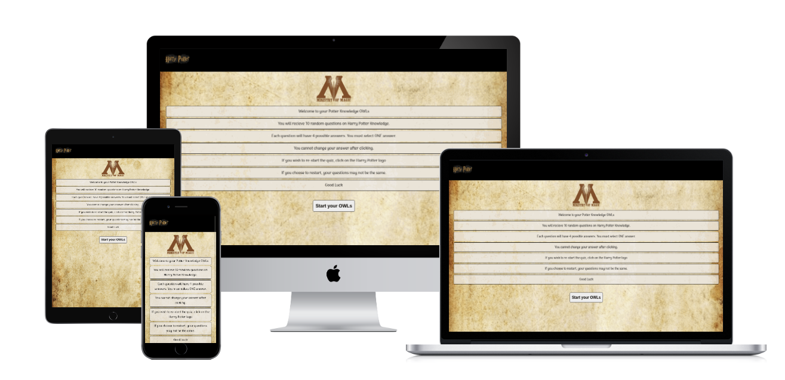
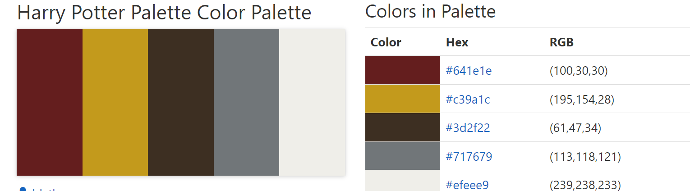
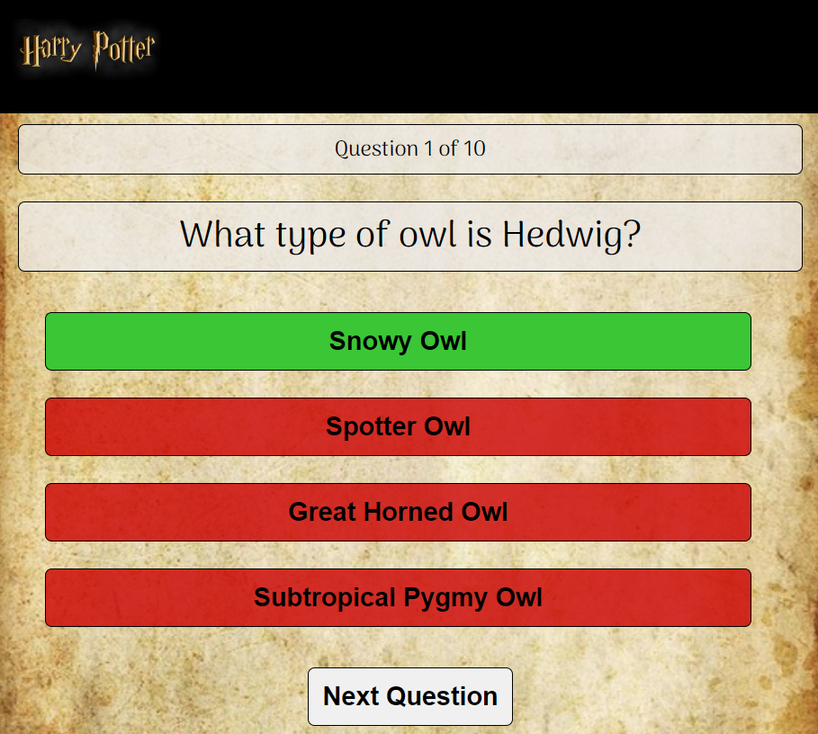
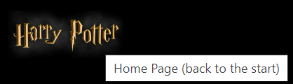

# Harry Potter Quiz - Portfolio 2: JavaScript

The Harry Potter Quiz is an interactive quiz where users sit their Harry Potter 'OWLs'. Based on the users correct answers out of 10, they are awarded a grading.
There are over 50 questions to allow the user to retake the quiz and not always get the same questions.

# Purpose

This project is a dynamic wesbite - a Harry Potter quiz. The game provides 10 questions which are chosen at random from a band of 50 questions, keeping the player amused for multiple game sessions. Based on the player's score, they are awarded an OWLs grade -these are the same gradings as the books.

The core purposes of the website:

- entertain players with a Harry Potter quiz
- provide correct answers after questions
- provide internal competition
- Be responsive so users can play on all devices

This website is built using HTMl, CSS and JavaScript for Code Institude's Full Stack Developer course - project 2.

[The live website is available here](https://emilycheatham.github.io/Project2Quiz/)
___

# User Experience (UX)

## User stories

### As a **first time user**

- I want to understand the purpose of the website and how to use it.
- I want to be able to play the game easily
- I want to know what the correct answer to the question is
- I want to know my score.
- I want to be able to navigate easily.
- I want to be amused

### As a **returning** and a **frequent user**

- I want different questions without repetition.
- I want to play multiple games.

### All users

- All users want to be able to comfortably view and access the website on different devices.

___

## Structure

The website has an instructions page, 10 questions and a results page. From the results page, the user can choose to 're-sit' the quiz, linking them back to the 10 questions. At all times, the user can restart the quiz by clicking on the Harry Potter logo in the top left hand corner.

### Home Page

- Helps the user to understand what type of game it is.
- Explains to the user how to play the game.
- Invites the user to start the game

#### User Goal

    > - Understand the main purpose of the website
    > - To understand how to play the game
    > - Be able to start the game
    > - Be amused

#### Website Goal

    > - Interest and engage the user
    > - Allow the user to understand how to play
    > - Allow the user to begin the game

### Question Section

- Displays question with 4 possible answers
- Display next question button once an answer is selected.
- Shows which answer is correct / incorrect once an answer is selected.
- Display what question out of ten they are on.

#### User Goal

    > - To take the quiz
    > - To know which is the correct answer, even if the wrong answer is selected - to have enough time to see this

#### Website Goal

    > - To entertain the user with the quiz
    > - Allow navigation to the next question.
    > - Provide question counter, displaying which question they are on.
    > - Provide which answer is the correct answer    

### Results Page

- Provides the user's score out of 10.
- Gives the user an OWL grading based on their score out of 10 

#### User Goal

    > - To know how many correct answers they acheived
    > - To be amused
    > - Have opportunity to play again

#### Website Goal

    > - To report to the user the number of correct answers they acheived
    > - To provide opportunity to play the quiz again.

___

## Wireframes

### **Introduction page**

### **Question section**

### **Results Page**

___

## Design

The Hssign for the Harry Potter quiz is inspired by the Hogwarts letter. 

### Colour Scheme

The colour palette was selected as the quiz is Harry Potter themed. The palette was found on the [Color-hex wesbite](https://www.color-hex.com). 

### Typography

Through the explortion of Harry Potter inspired fonts, I discovered the Jolly Lodger font on the[Apps That Deliver website - Harry Potter Fonts on Google Docs](https://appsthatdeliver.com/app-tutorials/google-docs/harry-potter-fonts-on-google-docs/). By using the website [fontjoy](https://fontjoy.com/) I was able to find and compare different fonts that had a balanced contrast to Jolly Lodger.

[JollyLodger](https://fonts.google.com/specimen/Jolly+Lodger?query=jolly) This was was chosen for the questions as it is similar to the logo font. It is bold and striking, but readable.

[Arima](https://fonts.google.com/specimen/Arima?query=arima) was used for all other text. It is clear and legible.

### Images

The Harry Potter Logo was sourced from: [Harry Potter Fan Zone](https://media.harrypotterfanzone.com/harry-potter-logo-tutorial-final.jpg)
The scroll background was sourced from: [Katie Apex](http://youve-reached-the-apex.weebly.com/blog/hogwarts-acceptance-letter)
The Ministry of Magic Logo was dourced from: [Wikipedia](https://en.wikipedia.org/wiki/Ministry_of_Magic)

### Accessibility

- Active tags have been added to menus to allow screen readers to see which page is currently open.
- Aria labels have been added on all images across the site to provide information to screen readers.

### Visual Effects

#### Hover on buttons

To increase users engagment and to minimise any errors, when the user hovers over the button, it highlights in orange.

#### Buttons

Once an answer has been selected, the correct answer will show. A button will then show. When cliked on, the next question will show. This minimises users accidently skipping questions. It allows the user to view the correct and incorrect answers in their own time, and to move to the next question when they are ready.

___

# Features

## Existing Features

- **Logo (Home Page)**

The Logo, which is also a link to the home page, is present on all pages on the website. By clicking on this, the user can navigate back to the Home page at any moment of the game. This is explained in the introduction, but also when hovered over, the title appears to help the user understand that it is a link.

Based on a media query, for mobile devices it become a dropdown "hamburger menu" feature. This allows for a better use of the space on smaller devices.

- **Hero image**

This section is the first thing the user sees opening the home page. It is clear what the site is about. It uses colours that match the colour scheme. The image involve a range of people of different ages, genders and races, showing the inclusive nature of the studio.
The semi-transparent overlay draws the eye, making it very clear what the site is about and where to find the studio. this stretches 60% over the width of the image.

On smaller devices, the semi-transparent overlay is 80% width to ensure all text is included whilst still being clear.

- **Why Practice Yoga section**
  
This section highlights the benefits of yoga.
Its layout is responsive to different devices.

- **Types of yoga offered section**

This section allows the user to have  brief overview of the different types of yoga offered in the studio. It gives enough information for users to be able to decide based on their experience and any physical requirements.
It is reponsive using flex-box to fit the text into all screen types.

- **Table for Class section**
This table is responsive. When hovered over, the row will highlight pink to make it easier to read certain types of yoga classes.
The divs are responsive. When in mobile view, the text is above the table. The table can be scrolled left to right so all information can be seen even on smaller devices with overflow.
On larger devices, the text moves to the left of the table, and the table expands to fill the width of the device's screen.

- **Gallery section**

This section provides 12 photos which include a range of ages, genders, abilities and classes. Set as grid, the images are all the same size. They are responsive to the device and will change how many images are on a row depending on the device size.

- **Sign Up section**

This section allows for users to ask an enquiry about one or more yoga class. It also allows for users to sign up for a class. Thy can select one or multiple class types. They can only do an enquiry or sign up, not both.
This form is responsive to different devices.

- **Footer**

The Footer contains the links to the social media - these are all active. It also provides the address, phone number and e-mail address. The email address will open in a new tab. The footer is responsive on mobiles.

## Feature Considerations

### Signup form processing

Currently, once the form on the Sign Up page is completed, it takes you to a thank you page. The data is not being processed or stored. This is also due to it being a fictional company. However, the data would ideally be stored, processed and analysed. Using this, online booking could be made with instant feedback, instead of having to wait for an e-mail response. This would make it more efficient for the company, and provide a more efficient and personalised quality experience for the user.

### Popup preview of Google Maps

In the wireframes, googlemaps was intetend to be placed in the footer. This was removed as I felt it would have been too large. This could be used in the About Us page, or as a pop up feature when the address in the footer is clicked on/hovered over.

### Link buttons

Originally the anchor links on the index page and the thank you page were buttons. They grew when you hovered over them. However, validator checks didn't like buttons and anchors together. I would like to redo these so they all look the same, and increase in size when hovered. The font would need shading to stand out more. I would like it to link to a certain section rather than just a page.

### Accessibility

Whilst the lighthouse checks rated the accessibility in the 90's, there is still room for improvement. One of the suggestions was that background and foreground colours do not have sufficent contrast ratio. Therefore, I would intend on experimenting with changing these to improve this contrast further whist still maintaining the colour scheme.
I would use the site I found at the end of my project, Toptal [Colorfilter](https://www.toptal.com/designers/colorfilter/)to improve access for those with colour-blindness.

___

# Technologies

- HTML to accomplish the structure of the website.
- CSS to style the website.
- [Balsamiq](https://balsamiq.com/wireframes/)- Used to create the wireframes
- Git - For version control.
- [GitHub](https://GitHub.com/) - To save and store the files for the website
- [Gitpod](https://gitpod.io/) - IDE to develop the website
- [Google Fonts](https://fonts.google.com/) - To import the fonts used on the wesbite
- [FontAwesome](https://fontawesome.com/) - For the inconography on the wesbite. v5.15.1 Icons.
- [Google Chrome Dev Tools](https://developers.google.com/web/tools/chrome-devtools)- To troubleshoot, debugging, inspecting page's elements, testing responsiveness and solvingiissues with responsiveness and styling.
- Paint - To crop images
- [CloudConvert](https://cloudconvert.com/webp-converter) and Pixelied [Pixelied](https://pixelied.com/convert/jpg-converter/jpg-to-webp) - to optomise larger images to reduce the storage and enhance wesbite performance.
- [pexels](https://www.pexels.com/) - To find and download royalty free images
- [Favicon.cc](https://www.favicon.cc/) - to create the website favicon.
- [Colorhunt](https://colorhunt.co/) - to source colour palette
- Google Chrome's [Lighthouse](https://developers.google.com/web/tools/lighthouse) - to access preformance and accesibility
- [W3C HTML Markup Validator](https://validator.w3.org/) to validate HTML code.
- [W3C Jigsaw CSS Validator](https://jigsaw.w3.org/css-validator/) to validate CSS code.
- [Markdown Tables Generator](https://www.tablesgenerator.com/) to generate tables for the readme file.
- Code Institute's Gitpod Template to generate the workspace for the project.

___

# Testing

Testing was ongoing throughout the entire build. Google Chrome Developer Dev tools was utilised to pinpoint and troubleshoot any issues. Every page was viewed on Dev Tools to check responsivity on different devices. The site was also trialled on a number of browsers (Google chrome, safari, Mozilla)

# User Stories

| Expectations                              | realisations                      |
|-------------------------------------------|-----------------------------------|
|**As a first time user**                   |                                   |
| I want to navigate the site easily        | The sticky nav bar allows the user to easily navigate on all devices and pages|
| I want to know where the studio is        | The hero image on the home page states it's in Richmond, London. The footer on all pages gives the exact address of the studio. |
|I want to know what types of yoga are offered and which one would suit me. | The home page has the 8 types of yoga offered. It gives a brief over view of what it is, who it is suitable for. The 3 event classes are explained on the home page. |
| I want to know the cost of the classes. | The price for individual classes and membership is stated on the About-Us page |
| I want to know when the classes are offered to see which one would suit me | The times of the classes are in a clear table on the About us page. |
| I want to know what things I need to bring | The about us page states the equipment the studio provides. It says you only need to bring water and a towel.|
| I want to be able to contact the studio. | Address, e-mail and phone number are on the footer of every page. The Sign up page allows for enquiries to be made. |
|**As a returning and frequent user**                   |                                   |
|I want to find I want to find up-to-date information about class times. | The about us page has the class type, the times that class is on, and which days |
| I want to be able enquire about classes or sign up to classes. | The sign up page has an option to sign up or enquire. There are also contact details on the footer if they prefer to phone |
| I want to be able to contact the studio | Address, e-mail and phone number are on the footer of every page. The Sign up page allows for enquiries to be made |
|**All users**                   |                                   |
| I want to be able to view the website comfortably on my device | Aria tags have been added for screen readers. Contracting backgrounds and fonts have been used to read easily. Responsiveness on device sizes has been added |

# Solved issues

The following issues arose and were solved through testing, tutor meetings, and peer advice.

- The table was too large and was overflowing into white space - a overflow-x scroll bar was added.
- The section that the table was in had white space on smaller devices - a div was added around the whole section and overflow: hidden was added.
- The sign up form was too small - text size was increased, padding added and block element added to the text-input.
- The text input sections overflowed out of the space, especially on smaller devices. A fiv with flex was added, and text overfolow: hidden.
- Initial testing on lighthouse raised that images were slowing down performance - images cropped and resized to fit space. Images converted to webp.

## Automated Testing

1. **[W3 Markup Validation](https://validator.w3.org/) - HTML Validation**

All pages were run through HTML Validator. No errors were detected.

- [Home Page HTML](assets/images/readme/IndexHTML.png)
- [About Us Page HTML](assets/images/readme/AboutUSHTML.png)
- [Gallery Page HTML](assets/images/readme/GalleryHTML.png)
- [Sign Up HTML](assets/images/readme/SignupHTML.png)
- [Thank You Page HTML](assets/images/readme/thankyouHTML.png)

1. **[W3 Jigsaw](https://jigsaw.w3.org/css-validator/) - CSS Validation**

CSS Stylesheet was run through CSS Validator. No errors were detected.

- [style.css CSS](assets/images/readme/CSSvalidation.png)

3. **[Google Lighthouse](https://developers.google.com/web/tools/lighthouse)**

**Home Page**

Mobile

Desktop

**About Us Page**

Mobile

Desktop

**Gallery Page**

Mobile

Desktop

**Signup Page**

Mobile

Desktop

**Thank-you Page**

Mobile

Desktop

___

# Deployment

This project was deployed to GitHub pages. The steps to deploy are as follows:

1. Log in (or sign up) to Github.
2. Find the repository for this project, Yoga For You.
3. Click on the Settings from the Repositories sub-headings.
4. Click on the Pages link in the left hand side navigation bar.
5. In the Source heading, choose main from the drop down select branch menu. Select Root from the drop down select folder menu.
6. Click Save.
7. A message that the website is ready to be deployed will appear. Refresh the page and the link to the deployed site will be available.
8. Your live Github Pages site is now deployed at the URL shown.

The live link can be found [here](https://emilycheatham.github.io/p1_yoga_for_you/).

## How to run this project Locally

- **Clone the repository**

1. Log in (or sign up) to GitHub.
2. Navigate to the GitHub Repository for this project, emilycheatham/p1_yoga_for_you
3. Click the code drop-down menu. Select whether you would like to clone with HTTPS, SSH or GitHub CLI and copy the link shown.
4. Open a terminal in the directory of your choice, type 'git clone' and paste the link from step 3.
5. A clone of the repository will now be created on your machine.

___

# Credits

## Code

- Tutorials from [Code Institute's](https://learn.codeinstitute.net/courses/course-v1:CodeInstitute+LRFX101+2023_Q2/courseware/e805068059af42af87681032aa64053f/1da6ad13213740f1855a51d30a2375b1/) Love Running Project were followed for the Love Project. This was used as a base structure for the design.
- Hover over images hover effect developed by following [Web Dev Simplifier](https://www.youtube.com/watch?v=tF3RE5CGt9U)

## Content

Content for the website was written by the owner Emily Cheatham

Readm.md file was created based on the structure of [Sofing](https://github.com/oks-erm/sofing/blob/main/README.md) and [Bully Book Club Wesbite](https://github.com/kera-cudmore/Bully-Book-Club/blob/main/README.md#Deployment)

## Media

- All images were taken from [pexels](https://www.pexels.com/).

## Acknowledgements

I would like to thank my mentor, Ronan McClelland, for his valuable guidance and support through the project.

I would like to thank the Slack community for answering questions before I even had them. 
___
